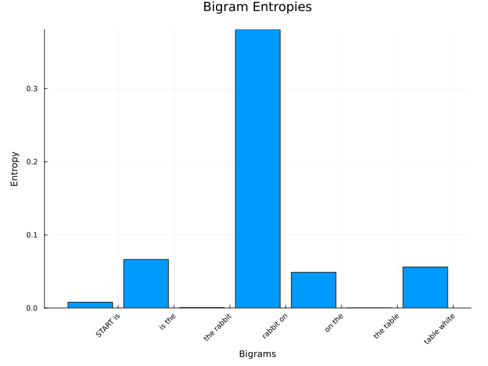
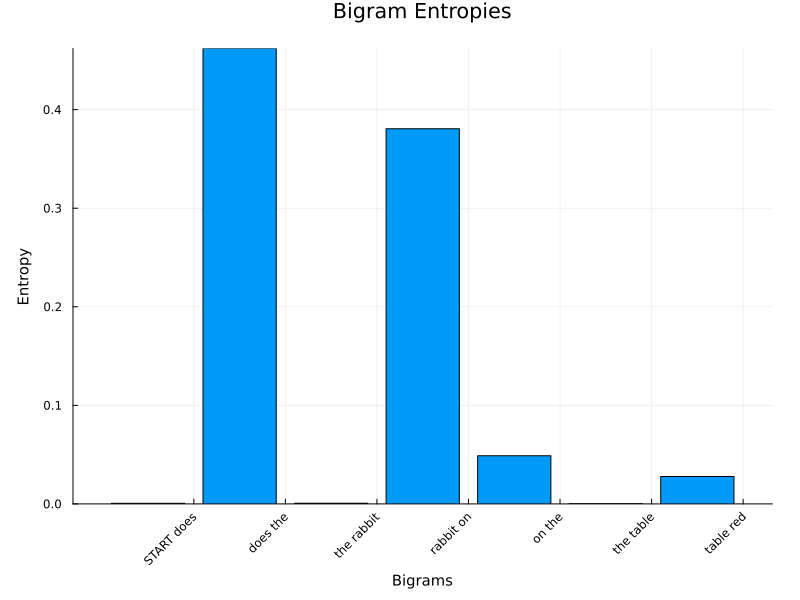
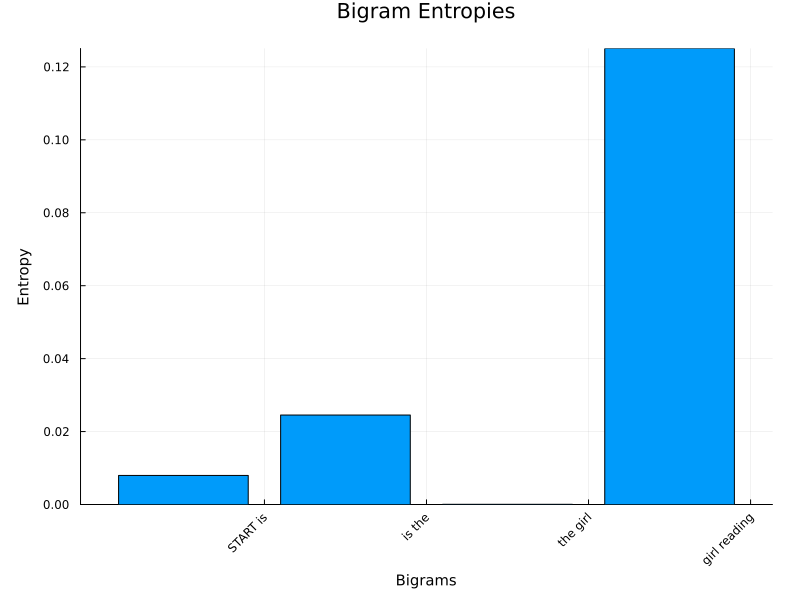
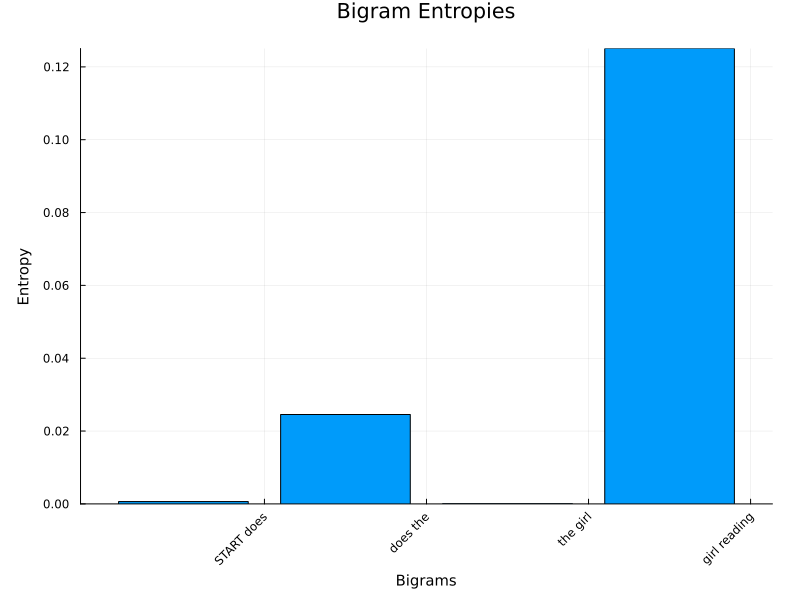
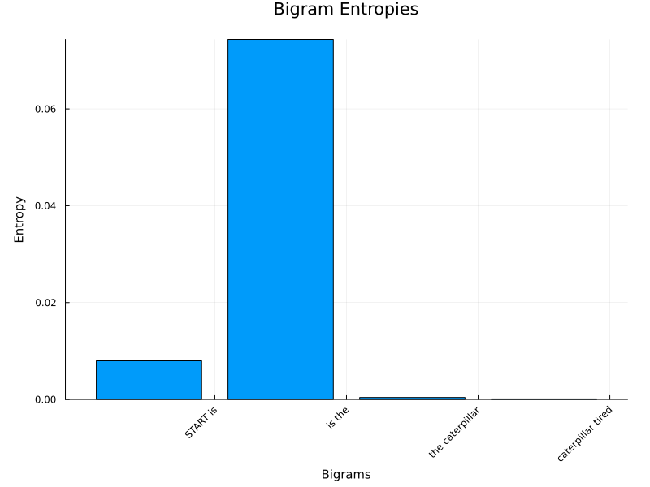
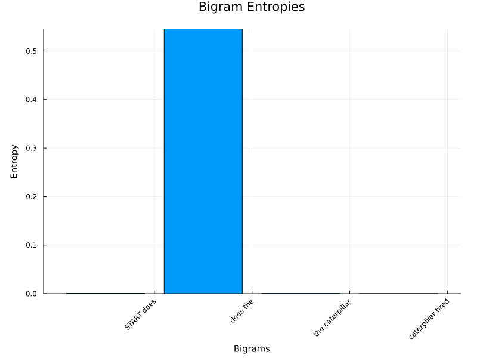
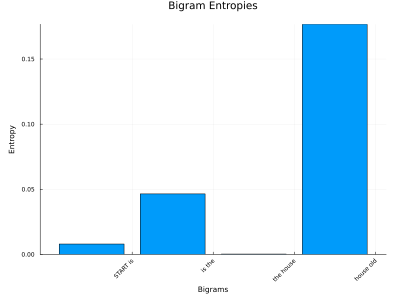
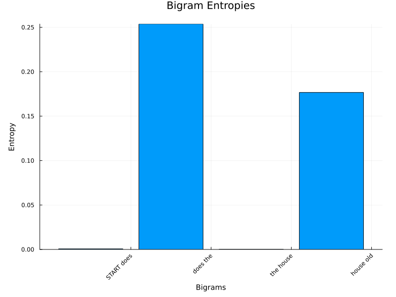

# 「不思議の国のアリス」のデータセットを用いた、文章の文法的正しさの分析

## 課題内容
「不思議の国のアリス」をコーパスとしてバイグラムを作成する。このバイグラムを用いて、以下の「文法的」な文と「非文法的」な文を判断することができるかについて調査する

|  | 文法的 | 非文法的 |
| --- | --- | --- |
| 1 | START is the rabbit on the table white END | START does the rabbit on the table white END |
| 2 | START is the girl reading END | START does the girl reading END |
| 3 | START is the caterpillar tired NED | START does the caterpillar tired END |
| 4 | START is the house old END | START does the house old END |

## データセットについて

データセットは [./data/20231102_alice.txt](./data/20231102_alice.txt)に格納されている。

## 前処理

データセットを確認した上で、前処理を以下の流れで実施した。

1. 全ての文字を小文字に変換
2. `won’t` `I’ve` `I’ll` `hadn’t` などの短縮形を非短縮形に変換
3. (省略形でない) `’` の消去
4. 句読点や `!` `?` などを区切りにそれぞれ文として分割
5. `START` `END` というダミー単語をそれぞれ文の先頭と末尾に挿入

Juliaにて処理の記述を行った。ソースコードは以下である。


```julia
using Statistics
using TextAnalysis

# ファイルを読み込む
file_path = "./data/20231102_alice.txt"
text = read(file_path, String)

# テキストを小文字に変換
text = lowercase(text)
doc = StringDocument(text)

# 短縮形を非短縮形に
include("./lib/expand_contractions.jl")
text = expand_contractions(text)

# ’を消去
text = replace(text, r"’" => "")

# 句読点や!?で文を分割
sentences = split(text, r"[—;:.?!“”(),\n]+")

# 各文を単語に分割し、STARTとENDを追加する
processed_sentences :: Vector{Vector{String}} = []
for sentence in sentences
    words :: Vector{String} = split(sentence)
    if isempty(words) || length(words) < 3
        continue
    end
    pushfirst!(words, "START")
    push!(words, "END")
    push!(processed_sentences, words :: Vector{String})
end

p_sentences = []

for sentence in processed_sentences
    push!(p_sentences, join(sentence, " "))
end

# 確認しやすくするため改行を挿入
processed_text = join(p_sentences, "\n")

# 保存
output = "./data/alice_processed.txt"
open(output, "w") do f
    write(f, processed_text)
end
```


    163818


## バイグラムの生成
`TextEntropyCalculator` にバイグラム生成機能を実装した。


```julia
include("./lib/probability.jl")

calculator = TextEntropyCalculator(processed_sentences)
```

## 交差エントロピーの計算
交差エントロピーの計算は `calculate_entropy` にて実装した。


```julia
include("./lib/probability.jl")
include("./lib/biagram_export.jl")

# 指定された文
case1 = ["START is the rabbit on the table white END", "START does the rabbit on the table red END"]
case2 = ["START is the girl reading END", "START does the girl reading END"]
case3 = ["START is the caterpillar tired END", "START does the caterpillar tired END"]
case4 = ["START is the house old END", "START does the house old END"]
e1_entropy, e1_words = calculate_entropy(calculator, case1[1])
generate_bigram_graph([e1_words, e1_entropy], "sample_graph")

function compare_2sentences(sentence1, sentence2, num)
    e1_entropy, e1_words = calculate_entropy(calculator, sentence1)
    e2_entropy, e2_words = calculate_entropy(calculator, sentence2)
    println("Cross Entropy: ", e1_entropy, " ", e2_entropy)
    generate_bigram_graph([e1_words, e1_entropy], "graph-$num-1")
    generate_bigram_graph([e2_words, e2_entropy], "graph-$num-2")
end
compare_2sentences(case1[1], case1[2], 1)
compare_2sentences(case2[1], case2[2], 2)
compare_2sentences(case3[1], case3[2], 3)
compare_2sentences(case4[1], case4[2], 4)
```

    Cross Entropy: 3.7372782731207037 3.898865476503925
    Cross Entropy: 4.064827431113122 4.571385722349202
    Cross Entropy: 4.882204968109567 4.990206264860539
    Cross Entropy: 3.578691063091667 3.7457068054967317
    


    "C:\\Users\\shion\\gitClones\\JuliaAliceBigram\\graph-4-2.png"


## 結果

エントロピーは以下のようになった。文法的なものは非文法的なものに比較してエントロピーが下がることが期待されるが、**全てのケースにおいて期待通りの結果が得られた。**

|  | 文法的 | 非文法的 | エントロピーによる判別 |
| --- | --- | --- | --- |
| 文1 | 3.7372782731207037 | 3.898865476503925 | 成功 (文法的＜非文法的) |
| 文2 | 4.064827431113122 | 4.571385722349202 | 成功(文法的＜非文法的) |
| 文3 | 4.882204968109567 | 4.990206264860539 | 成功 (文法的＜非文法的) |
| 文4 | 3.578691063091667 | 3.7457068054967317 | 成功 (文法的＜非文法的) |

## エントロピーの寄与度の分析

それぞれの交差エントロピーについて、どの部分が違いに寄与しているのかを調べるため、それぞれでのエントロピーの量をグラフ化してまとめたところ、以下のようになった。

### 文1
#### 文法的

#### 非文法的


### 文2
#### 文法的

#### 非文法的


### 文3
#### 文法的

#### 非文法的


### 文4
#### 文法的

#### 非文法的


